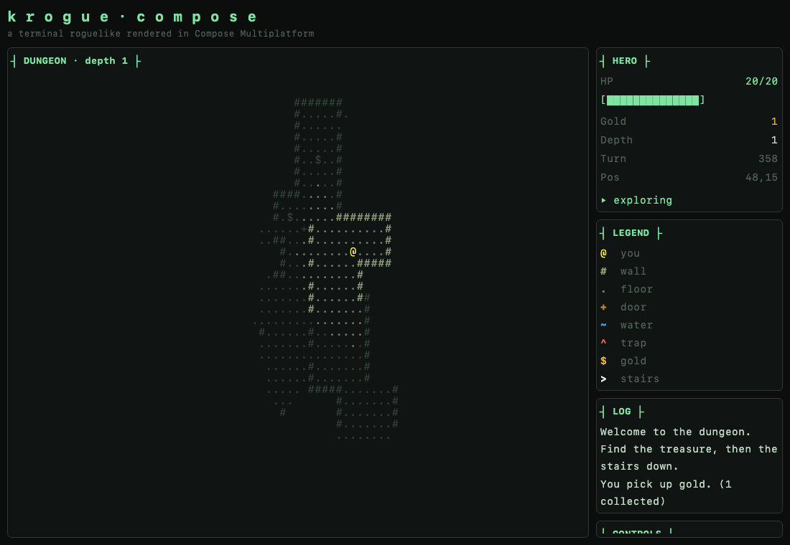

# krogue-compose

A terminal-style roguelike rendered with **Compose Multiplatform**, instead of a
real terminal library. The point of using Compose is laying
out several text "panels" side-by-side and stacked, while keeping the classic
ASCII look. The field-of-view and dungeon-generation algorithms are ported from
[`krogue-kotter`](https://github.com/griffio/krogue-kotter).



## Milestone 1 — movement, generated map, field of vision

- **Procedural dungeon** — rooms grown and connected by one-tile corridors
  (the pushcx/ironwood algorithm), with scattered gold (`$`) and a down-stairs
  (`>`).
- **Recursive shadowcasting FOV** — eight-octant light casting around the hero
  with a fog of war: currently-visible tiles are bright, previously-seen tiles
  are dimmed from memory, unseen tiles are blank.
- **Movement** — arrow keys, `wasd`, or vi keys (`hjkl`). Walking onto `$`
  collects gold, `~` water and `^` traps cost HP, and `>` descends to a freshly
  generated, slightly tougher level. `R` starts a new game.
- **Tiled terminal UI** — a map section beside stacked HERO / LEGEND / LOG /
  CONTROLS sections, all drawn in a monospace, ANSI-flavoured palette.

## Tech

| | |
|---|---|
| Language | Kotlin 2.4.0 |
| Toolchain | Java 21 |
| UI | Compose Multiplatform 1.11.0 |
| Targets | Desktop (JVM) and Web (WasmJs) |
| Coroutines | kotlinx-coroutines 1.11.0 |
| Build | Gradle 9.4.0 (wrapper) |

## Project layout

```
composeApp/
  src/commonMain/kotlin/griffio/krogue/
    game/          # pure, multiplatform game core (no UI, no platform APIs)
      Terrain.kt           # tile kinds + glyphs
      DungeonGenerator.kt  # room-growing map generation
      ShadowCast.kt        # recursive-shadowcasting FOV
      GameState.kt         # observable model: hero, hp, fog grids, movement
    ui/            # Compose terminal renderer
      TerminalTheme.kt     # palette
      MapPanel.kt          # camera viewport, per-row AnnotatedString grid
      Panels.kt            # HERO / LEGEND / LOG / CONTROLS sections
      GameScreen.kt        # layout + keyboard input
    App.kt         # shared composable entry point
  src/jvmMain/     # desktop window entry point + headless screenshot tool
  src/wasmJsMain/  # browser entry point + index.html
  src/commonTest/  # generation / FOV / movement tests
```

The `game` package is platform-agnostic and unit-tested; the `ui` package and
the entry points are the only Compose/platform code.

## Running

Desktop:

```bash
./gradlew :composeApp:run
```

Web (WasmJs) in the browser:

```bash
./gradlew :composeApp:wasmJsBrowserDevelopmentRun
```

Tests:

```bash
./gradlew :composeApp:jvmTest
```

Headless UI render (writes a PNG without opening a window — handy for CI /
visual checks). Optional second arg scripts N random-walk steps first:

```bash
./gradlew renderScreenshot --args="/tmp/krogue.png"
./gradlew renderScreenshot --args="/tmp/krogue.png 400"
```

## Controls

| Action | Keys |
|---|---|
| Move | `↑ ↓ ← →` · `w a s d` · `h j k l` |
| Descend | walk onto `>` |
| New map | `R` |
