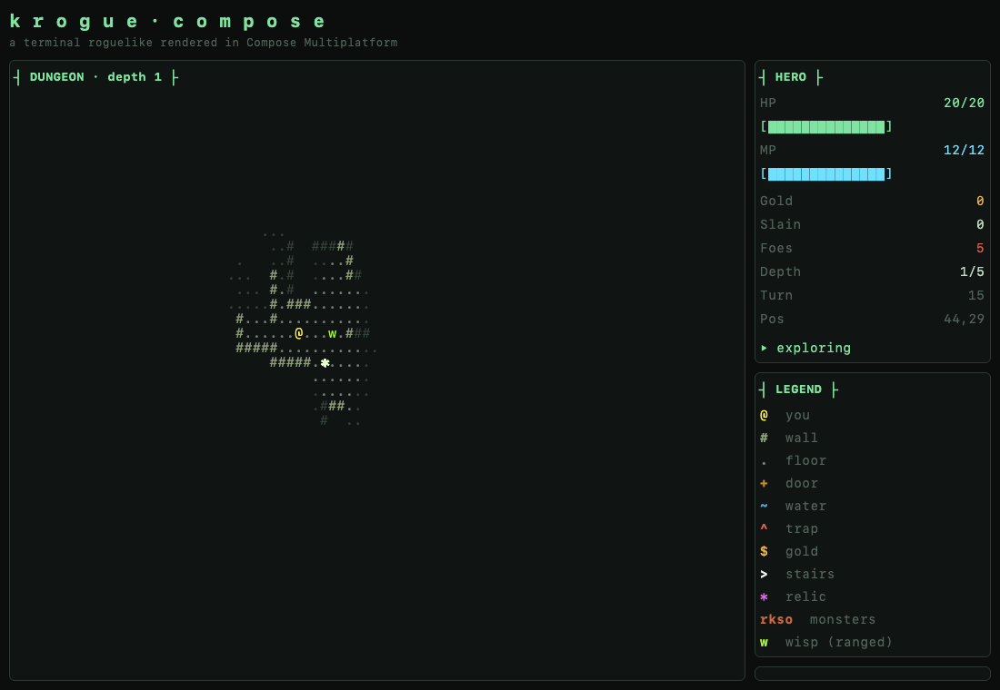

# krogue-compose

A terminal-style roguelike rendered with **Compose Multiplatform**, instead of a
real terminal library. The point of using Compose is laying
out several text "panels" side-by-side and stacked, while keeping the classic
ASCII look. The field-of-view and dungeon-generation algorithms are ported from
[`krogue-kotter`](https://github.com/griffio/krogue-kotter).



## Milestone 4 — greater threats: ranged casters, door traps, ambushes

- **Ranged casters** — the `w` wisp doesn't close in: with line of sight and in
  range it *winds up* (a charge pulse + a log warning) and looses a venom bolt the
  next turn. Counterplay: break line of sight to make it whiff, or close to melee
  to disrupt the shot. This punishes standing back and plinking with spells.
- **Hidden door traps** — the `~` water and `^` trap terrains were wired all along
  but never placed; M4 scatters them onto the floor around `+` doorways (and a few
  in rooms). Traps are **hidden** — drawn as plain floor — until you step adjacent,
  then shown as `^` so you can route around them, or risk a 1-wide corridor.
- **Sleeping monsters & ambush** — monsters start dormant and only wake when they
  see you within range (or take a hit), so a room can erupt at once instead of
  trickling out. Getting greedy near a packed room is now dangerous.

## Milestone 3 — ranged spells & ASCII particle effects

- **Two spells, keyboard-cast** — `F` throws a single-target **fire bolt**; `B`
  looses an **energy blast** that detonates for area damage. Both auto-target the
  nearest visible monster; `Tab` cycles targets (the locked foe is highlighted).
- **Mana** — an `MP` pool gates casting and regenerates slowly (one point every
  few turns), so spells are a resource to ration rather than spam.
- **Instant sim, animated playback** — a cast resolves immediately (line of fire
  traced to the first wall or monster, damage applied, mana spent); the projectile
  and explosion are pure eye-candy played over the already-settled state, so the
  turn-based core never depends on the animation.
- **ASCII particles** — the effects layer grew from floating numbers into a small
  particle taxonomy: a **bolt** glyph travelling its line with a fading trail, and
  an expanding **burst** ring at impact, both coloured by an age-keyed ramp
  (white-hot → orange → red → smoke for fire; an icy ramp for energy). In the
  spirit of the [Grid Sage Games particle write-up](https://www.gridsagegames.com/blog/2014/03/particle-effects/).

## Milestone 2 — monsters, combat, a winnable loop, and an effects layer

- **Monsters** — rats `r`, kobolds `k`, snakes `s`, and orcs `o` spawn per level,
  scaling in count and roster with depth. A monster that can see the hero (its
  tile is lit by the shared FOV) chases along the dominant axis; otherwise it
  wanders. They're rendered only where you can currently see them.
- **Melee combat** — move into a foe to attack (bump-to-attack); adjacent
  monsters strike back on their turn. The hero's damage grows slightly with
  depth. Hit numbers float up over the grid: red for damage taken, yellow for
  damage dealt.
- **A winnable loop** — descend to depth `5`, where the down-stairs are replaced
  by the relic `*`. Reach it to win; die, and it's `R` to start over.
- **Real-time effects layer** — a frame-driven (`withFrameNanos`) Canvas overlaid
  on the text grid, fed by semantic game events. The floating combat numbers are
  the first effect; the layer is the seam future particle effects plug into,
  with the turn-based core left untouched.

## Milestone 1 — movement, generated map, field of vision

- **Procedural dungeon** — rooms grown and connected by one-tile corridors
  (the pushcx/ironwood algorithm), with scattered gold (`$`) and a down-stairs
  (`>`).
- **Recursive shadowcasting FOV** — eight-octant light casting around the hero
  with a fog of war: currently-visible tiles are bright, previously-seen tiles
  are dimmed from memory, unseen tiles are blank.
- **Movement** — arrow keys, `wasd`, or vi keys (`hjkl`). Walking onto `$`
  collects gold, `~` water and `^` traps cost HP, and `>` descends to a freshly
  generated, slightly tougher level. `R` starts a new game.
- **Tiled terminal UI** — a map section beside stacked HERO / LEGEND / LOG /
  CONTROLS sections, all drawn in a monospace, ANSI-flavoured palette.

## Tech

| | |
|---|---|
| Language | Kotlin 2.4.0 |
| Toolchain | Java 21 |
| UI | Compose Multiplatform 1.11.0 |
| Targets | Desktop (JVM) and Web (WasmJs) |
| Coroutines | kotlinx-coroutines 1.11.0 |
| Build | Gradle 9.4.0 (wrapper) |

## Project layout

```
composeApp/
  src/commonMain/kotlin/griffio/krogue/
    game/          # pure, multiplatform game core (no UI, no platform APIs)
      Terrain.kt           # tile kinds + glyphs
      DungeonGenerator.kt  # room-growing map generation
      ShadowCast.kt        # recursive-shadowcasting FOV
      Monster.kt           # monster kinds (incl. ranged wisp), spawning, AI state
      Spell.kt             # spells, costs, and Bresenham line-of-fire / line-of-sight
      Effects.kt           # game events + particle model (text/bolt/burst) + colour ramps
      GameState.kt         # observable model: hero, monsters, combat, spells, traps, AI
    ui/            # Compose terminal renderer
      TerminalTheme.kt     # palette (terrain + monster colours)
      MapPanel.kt          # camera viewport, per-row AnnotatedString grid, target marker
      EffectsOverlay.kt    # Canvas + withFrameNanos loop drawing the particles
      Panels.kt            # HERO / LEGEND / LOG / CONTROLS sections
      GameScreen.kt        # layout + keyboard input (move / cast / target)
    App.kt         # shared composable entry point
  src/jvmMain/     # desktop window entry point + headless screenshot tool
  src/wasmJsMain/  # browser entry point + index.html
  src/commonTest/  # generation / FOV / movement tests
```

The `game` package is platform-agnostic and unit-tested; the `ui` package and
the entry points are the only Compose/platform code.

## Running

Desktop:

```bash
./gradlew :composeApp:run
```

Web (WasmJs) in the browser:

```bash
./gradlew :composeApp:wasmJsBrowserDevelopmentRun
```

Tests:

```bash
./gradlew :composeApp:jvmTest
```

Headless UI render (writes a PNG without opening a window — handy for CI /
visual checks). Optional second arg scripts N random-walk steps first:

```bash
./gradlew renderScreenshot --args="/tmp/krogue.png"
./gradlew renderScreenshot --args="/tmp/krogue.png 400"
```

## Controls

| Action | Keys |
|---|---|
| Move | `↑ ↓ ← →` · `w a s d` · `h j k l` |
| Attack | move into a monster |
| Fire bolt | `F` |
| Energy blast | `B` |
| Cycle target | `Tab` |
| Descend | walk onto `>` |
| Win | reach the relic `*` on depth 5 |
| New map | `R` |
